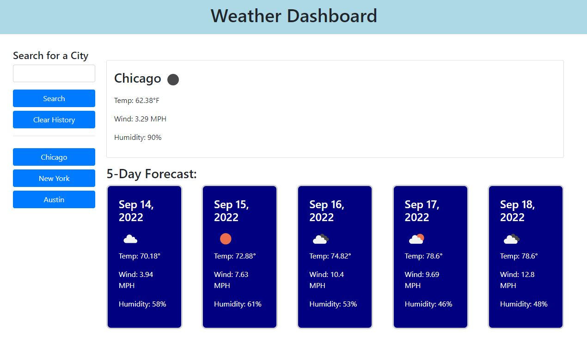

# Third-Party APIs - Weather Dashboard

## Description
In order learn more about third-party APIs and retrieving & using data from another application's API, I created a simple weather dashboard that runs in the browswer and feautures dynamically updated HTML and CSS code powered by jQuery and the [Moment.js](https://momentjs.com/) library.

- Used the [OpenWeather current weather data](https://openweathermap.org/current) to retrieve current weather data for cities. 
- Used the [OpenWeather 5 day/3 hour forecast data](https://openweathermap.org/forecast5) to retrieve forecasted weather data for cities.

## Installation

N/A

## Usage

Application deployed at the following link: https://park-d.github.io/weather-dashboard/

When a user opens the page, they are presented with a header and a simple search box. When they type in a valid city name, they are presented with the current location, date, an icon of the current weather, temperature, wind, and humidity. They also receive a 5 day forecast with the same traits. When they search a city, it gets saved onto the browser for future use, and to recall after other searches. They can also clear their search history at any point. 

## Credits

While working on the Module-6 Challenge, I was in a study group with Jackson Myhre and Roy Logan from the same bootcamp class.

## License

N/A

## Notes

Our instructor asked us to use the city url and display the data provided by the api url. UV index is not present in new free version of api, and the lat and lon values are also not working in url. We were asked to use the free APIs only and the free APIs do not have UV index.
